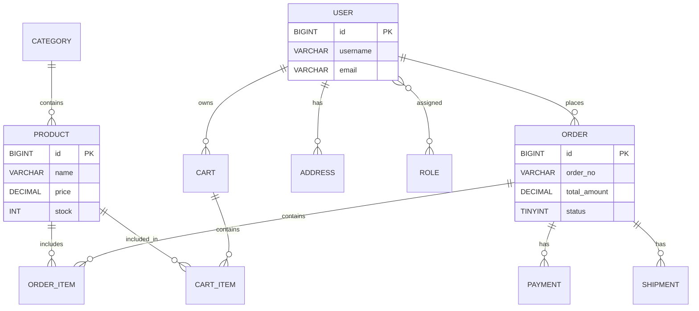

# 数据库设计（ER 图 与 建表脚本说明）

> 版本：v0.1

## 1. 目标
- 设计支持 SCUT-Shop 的核心数据模型：用户、商品、购物车、订单、支付与发货相关表。
- 提供可直接执行的 MySQL DDL（兼容 MySQL 8.x，使用 InnoDB、utf8mb4）。

## 2. ER 图（Mermaid）

> 注：如果你的可视化工具不支持 Mermaid，我可以另外生成 PNG/SVG。

## 3. 表说明（简要）
- `user`：存储用户基础信息（用户名、邮箱、密码哈希、是否启用等）。
- `role`, `user_role`：支持角色扩展（USER/ADMIN）。
- `product`, `category`：商品与分类信息，包含库存、价格、状态等。
- `cart`, `cart_item`：购物车与明细（支持游客或登录用户）。
- `address`：用户收货地址。
- `order`, `order_item`：订单与明细，订单状态记录流程（创建/已支付/已发货/已完成/已取消/退款）。
- `payment`：支付记录（方法、金额、交易号、时间）。
- `shipment`：发货记录（快递公司、运单号、发货时间、状态）。

## 4. 建表脚本（db/schema.sql）
- 已将详细 SQL DDL 保存为 `db/schema.sql`（请查看仓库中的文件）。

---

如果你希望，我可以：
- 生成可视化 ER 图图片（PNG/SVG），或
- 直接把 DDL 在本地数据库中执行并生成迁移脚本（Flyway 或 Liquibase）。

请选择下一步（例如：“生成 ER 图图片”或“把 DDL 应用到本地 MySQL”）。