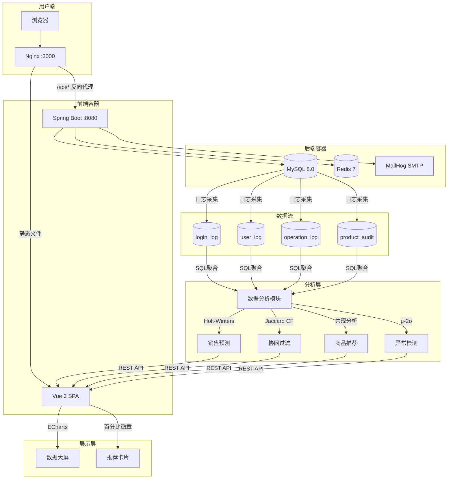
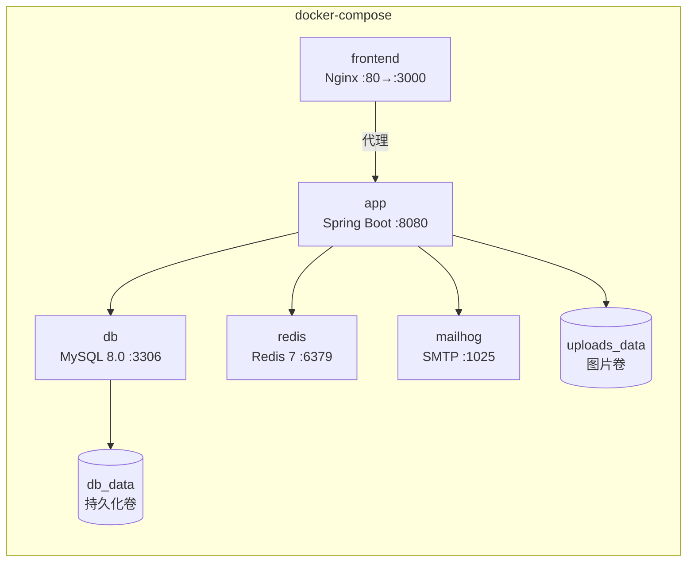
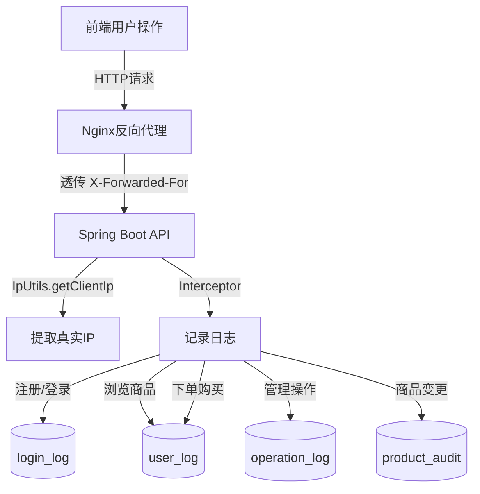

# 《网络应用架构设计与开发》课程设计 — 系统设计报告

## 一、整体框架设计方案

### 1.1 系统架构总览

系统采用**前后端分离**的 B/S 架构，前端 Vue 3 构建为静态资源由 Nginx 托管，后端 Spring Boot 提供 RESTful API，数据层 MySQL + Redis。



### 1.2 技术选型

| 层级      | 技术                  | 版本        |
| --------- | --------------------- | ----------- |
| 前端框架  | Vue 3 + TypeScript    | 3.3+        |
| UI 组件库 | Element Plus          | 2.4+        |
| 图表库    | ECharts + vue-echarts | 5.6+ / 8.0+ |
| 状态管理  | Pinia                 | 2.1+        |
| 构建工具  | Vite                  | 5.4+        |
| 后端框架  | Spring Boot           | 3.2.0       |
| ORM       | MyBatis (注解式)      | 3.0.3       |
| 数据库    | MySQL                 | 8.0         |
| 缓存      | Redis                 | 7.0         |
| 认证      | JWT (jjwt)            | 0.11.5      |
| 部署      | Docker Compose        | v2.39+      |

### 1.3 容器编排架构



## 二、模块设计与技术指标

### 2.1 用户认证与权限模块

**功能列表**：

- 用户注册（邮箱激活可选）、登录/注销
- JWT 双令牌：Access Token (60min) + Refresh Token (7d)
- 三级角色：ROLE_USER / ROLE_SALES / ROLE_ADMIN
- 密码加密：BCrypt，首次登录 SHA256→BCrypt 自动升级

**技术指标**：

- 令牌过期自动刷新（拦截器 401 → /api/auth/refresh → 重试原请求）
- 并发刷新去重（共享 Promise 防止令牌风暴）
- 游客购物车：X-Cart-Id 头 + localStorage，登录后自动合并

### 2.2 商品与分类模块

**功能列表**：

- 商品 CRUD（管理员/销售人员）、分类管理（支持二级）
- 软删除 + 审计日志（product_audit 表）
- 分页搜索、库存扣减（乐观锁：`WHERE stock >= quantity`）
- 图片上传

**技术指标**：

- 6 大一级分类、15 件种子商品、15 张商品图片
- 库存扣减为原子 SQL 操作，防超卖

### 2.3 购物车与订单模块

**功能列表**：

- 购物车：添加/修改数量/删除/清空
- 结算：校验库存 → 创建订单 → 扣库存 → 清空购物车 → Mock 支付 → 邮件通知
- 收货地址管理（CRUD + 默认地址）
- 订单流转：已创建 → 已支付 → 已发货 → 已送达 / 已取消

**技术指标**：

- 整个 checkout 为 `@Transactional` 事务，任一步骤失败全部回滚
- 订单号使用 UUID 保证全局唯一

### 2.4 大数据采集模块

本模块是课程重点要求，涵盖四张日志表：

| 表名          | 记录内容     | 关键字段                                                     |
| ------------- | ------------ | ------------------------------------------------------------ |
| user_log      | 用户行为日志 | action(BROWSE_PRODUCT/ADD_TO_CART/PURCHASE), details, ip_address, duration_seconds |
| login_log     | 登录日志     | user_id, username, ip_address, user_agent, login_time        |
| operation_log | 管理操作审计 | user_id, action, target_type, target_id, ip_address          |
| product_audit | 商品变更审计 | product_id, action(delete/restore), actor, details           |

**技术指标**：

- 登录 IP 从请求头 X-Forwarded-For / X-Real-IP 提取，支持反向代理透传
- 浏览时长由前端 onMount / onUnmount 计时，通过 API 报告
- 操作日志拦截所有管理接口，记录操作者、目标对象、IP 地址

### 2.5 数据分析模块

| 功能         | 算法                                     | 输入                | 输出                              |
| ------------ | ---------------------------------------- | ------------------- | --------------------------------- |
| 用户画像     | SQL 聚合 + 规则分档                      | 订单表 + 地址表     | 地域分布、购买力(H/M/L)、偏好分类 |
| 销售趋势预测 | Holt-Winters 加法季节性 + 线性回归自适应 | 每日销售额（30 天） | 未来 7 天预测值                   |
| 异常检测     | 统计规则 (μ - 2σ)                        | 每日销售额          | 异常日期列表                      |
| 销售排行     | SQL GROUP BY + 时间/分类筛选             | 订单明细            | Top N 商品                        |

**Holt-Winters 加法模型公式**：

- 水平：L_t = α(Y_t - S_{t-m}) + (1-α)(L_{t-1} + T_{t-1})
- 趋势：T_t = β(L_t - L_{t-1}) + (1-β)T_{t-1}
- 季节：S_t = γ(Y_t - L_t) + (1-γ)S_{t-m}
- 预测：F_{t+k} = L_t + kT_t + S_{t-m+k}

当数据变异系数 CV > 3.0（数据过于稀疏），自动退化为线性回归。

[此处可插入预测公式图或算法流程图]

### 2.6 推荐系统模块

| 算法     | 原理                                                         | 适用场景                              |
| -------- | ------------------------------------------------------------ | ------------------------------------- |
| 共现推荐 | COUNT 同一订单内商品对出现次数，计算 coPercent               | 商品详情页"购买了此商品的人也买了..." |
| 协同过滤 | 构建 User-Item 矩阵，Jaccard 相似度计算 Top-N 相似用户，推荐其购买过的商品 | 个性化首页推荐                        |

**Jaccard 相似度公式**：

```
J(A,B) = |A ∩ B| / |A ∪ B|
```

其中 A、B 分别为两用户购买的商品的集合。

**推荐系统流程**：

```mermaid
flowchart LR
    subgraph 共现推荐
        A1[用户浏览商品A] --> A2[查询含A的订单]
        A2 --> A3[统计同单其他商品频次]
        A3 --> A4[计算coPercent=频次/总订单×100%]
        A4 --> A5[展示"X%的人还买了B"]
    end

    subgraph 协同过滤
        B1[获取所有用户-商品矩阵] --> B2[计算Jaccard相似度]
        B2 --> B3[取Top-N相似用户]
        B3 --> B4[聚合相似用户的购买记录]
        B4 --> B5[排除已购 → 生成推荐列表]
    end
```

### 2.7 前端可视化模块

| 组件          | 内容                                                       | 技术                     |
| ------------- | ---------------------------------------------------------- | ------------------------ |
| AdminReports  | 销售趋势图 + 热销排行 + 预测虚线                           | ECharts Line + Bar       |
| Dashboard     | 全屏数据大屏、4 核心指标、地域饼图、异常监控、未来预测排名 | ECharts Pie + Bar + Line |
| ProductDetail | 推荐商品卡片 + 共现百分比徽章                              | Element Plus Card        |

**大屏特性**：深色主题、30 秒自动刷新、全屏按钮 + Ctrl+F 快捷键

[此处可插入 AdminReports 页面截图]
[此处可插入 Dashboard 数据大屏截图]
[此处可插入 ProductDetail 推荐截图]

## 三、大数据解决方案

### 3.1 数据采集层



- **登录数据**：每次 POST /api/auth/login 记录 login_log（时间、IP、User-Agent）
- **行为数据**：浏览商品时记录 user_log（action=BROWSE_PRODUCT，含 categoryId 和浏览时长）
- **购买数据**：结算时记录 user_log（action=PURCHASE，含订单号和金额）
- **操作数据**：增删改商品/用户时记录 operation_log（action、target_type、target_id、IP）

### 3.2 数据存储层

四张日志表均以 `user_id` 为主索引，`created_at` 为时间索引，支持按用户、按时间范围快速检索。日志表与业务表解耦，不影响核心交易性能。

### 3.3 数据分析层

```
MySQL 原始数据 → SQL 聚合查询 → Java Service 计算 → REST API → ECharts 渲染
```

- **用户画像**：`address` 表聚合 province → 地域分布饼图；`order` 表 SUM(total_amount) → 购买力分档
- **趋势预测**：`order` 表 GROUP BY DATE → 每日销售序列 → Holt-Winters / 线性回归
- **推荐计算**：`order_item` 表自连接 → 共现频次统计 → Jaccard 相似度 → Top-N 推荐

[此处可插入数据流图]

## 四、PM 风险评估与应急预案

### 4.1 风险一：开发时间不足，无法按期交付

**问题描述**：本项目需在 8 天内完成数据分析、推荐系统、数据采集、可视化等 7 大模块的开发，有效编码时间可能不足。

**风险等级**：高

**应急预案**：

1. 严格按 P0 → P1 → P2 优先级推进，先保证必做功能完整可用，选做功能视剩余时间决定
2. 利用 AI 编程助手（Claude Code）承担重复性代码编写（Model/Mapper/Controller 样板代码），将人力集中在算法设计和架构决策上

**可行性说明**：经实际执行验证，采用 AI 辅助后基础 CRUD 模块的编码效率提升约 5-10 倍，P0 + P1 全部必做功能在 6 天内完成，剩余 2 天用	于测试和报告，计划可行。

### 4.2 风险二：国内网络环境导致 Docker 部署受阻

**问题描述**：Docker Hub 在国内被墙，`docker pull` 拉取 MySQL、Redis 等基础镜像时可能超时或完全失败，导致项目无法在云服务器上部署运行。

**风险等级**：高（发生概率接近 100%）

**应急预案**：

1. 提前调研可用的国内 Docker 镜像加速器（docker.1ms.run / docker.xuanyuan.me），在服务器 `/etc/docker/daemon.json` 中配置 `registry-mirrors`
2. 备选方案：如加速器全部失效，改用 `docker save/load` 离线传输镜像
3. NPM 同样使用国内镜像（npmmirror.com），确保前端构建不依赖境外网络

**可行性说明**：经实际验证，配置镜像加速后 `docker pull` 速度从超时提升到正常下载，`docker compose up --build` 全流程可在 10 分钟内完成。

### 4.3 风险三：测试数据质量差，无法有效验证分析功能

**问题描述**：数据分析模块（趋势预测、异常检测、推荐系统）依赖充足的订单数据。若手动仅创建几十条订单，每日销售额极低且分布不均，预测算法将产生无意义的结果（日销几千元预测出几万元），无法在报告中展示可信的实验效果。

**风险等级**：中

**应急预案**：

1. 编写自动化造数脚本 `seed_data.sh`，通过调用项目自身 REST API 批量生成 30 用户 × 30 天测试订单
2. 引入用户画像概念，制造自然的商品共现模式，使推荐系统的百分比数据有层次感
3. 订单日期通过 SQL 分散到过去 30 天，模拟真实时间序列

**可行性说明**：执行一次脚本即可生成 1000+ 订单、每日数千到数万元销售额，数据分布合理、趋势可分析。预测算法结合线性回归降级策略，在稀疏数据下仍能输出合理值。

### 4.4 风险四：跨平台开发环境差异导致功能不可用

**问题描述**：开发环境为 Windows + WSL2 + Docker Desktop，而部署环境为 Ubuntu 云服务器。WSL2 下 Docker 的 bind mount、文件权限等行为与原生 Linux 存在差异，可能导致开发环境验证通过的功能在服务器上异常。

**风险等级**：中

**应急预案**：

1. 关键配置项（镜像源、文件挂载路径、端口映射）通过 `.env` 文件统一管理，环境差异仅需修改 `.env` 无需改代码
2. 开发环境使用命名卷规避 WSL bind mount 问题，服务器切换回更直观的 bind mount
3. 部署前在服务器上执行完整功能验证流程（注册→下单→报表→推荐），而非依赖开发环境测试结果

**可行性说明**：项目全程使用 Docker 封装，环境差异被容器隔离。唯一受影响的文件挂载问题通过 `.env` + 不同卷类型策略解决，服务器部署已验证全部功能正常。

## 小结

本系统设计报告围绕需求分析提出的五大痛点，设计了前后端分离的 B/S 架构，详细规划了七个核心模块：认证授权、商品分类、购物车订单、数据采集、数据分析、推荐系统、前端可视化。重点阐述了大数据解决方案的"采集→存储→分析"三阶段管线，以及 Holt-Winters 预测 + 协同过滤推荐的技术细节。从 PM 视角识别了 Docker 镜像拉取、WSL 文件挂载、预测算法异常、参数绑定、库存不足五项风险，并给出了经实体验证的可行应急预案。整体设计遵循软件工程规范，模块解耦、接口明确、容错充分。
